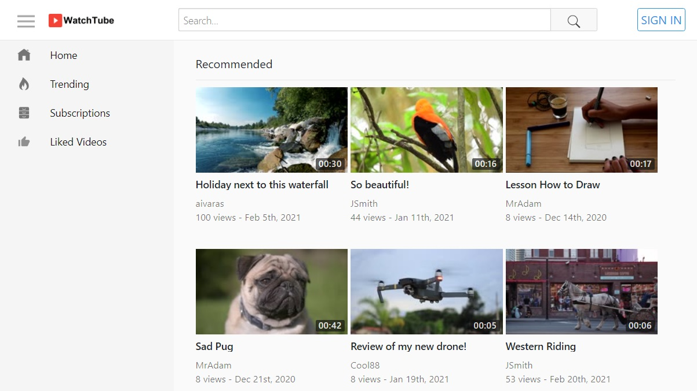
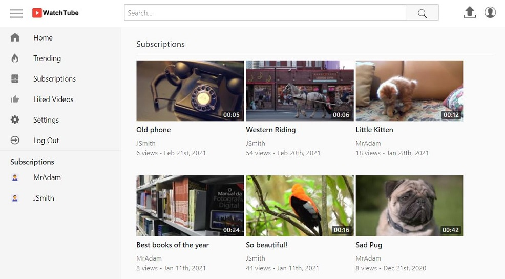
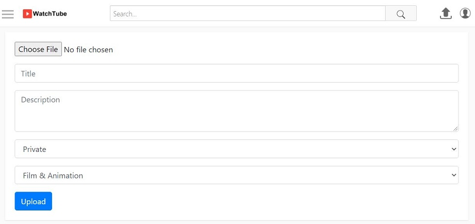
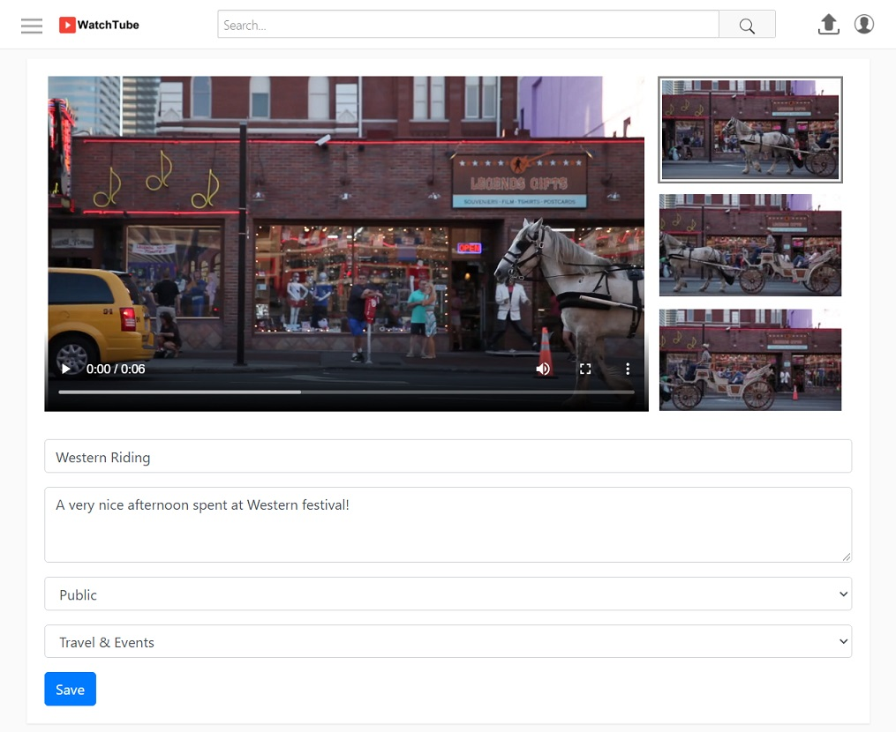
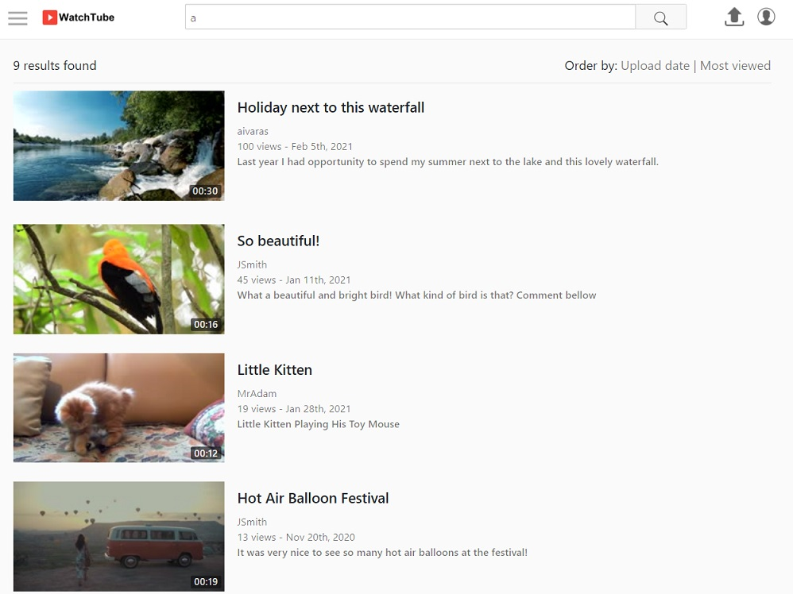
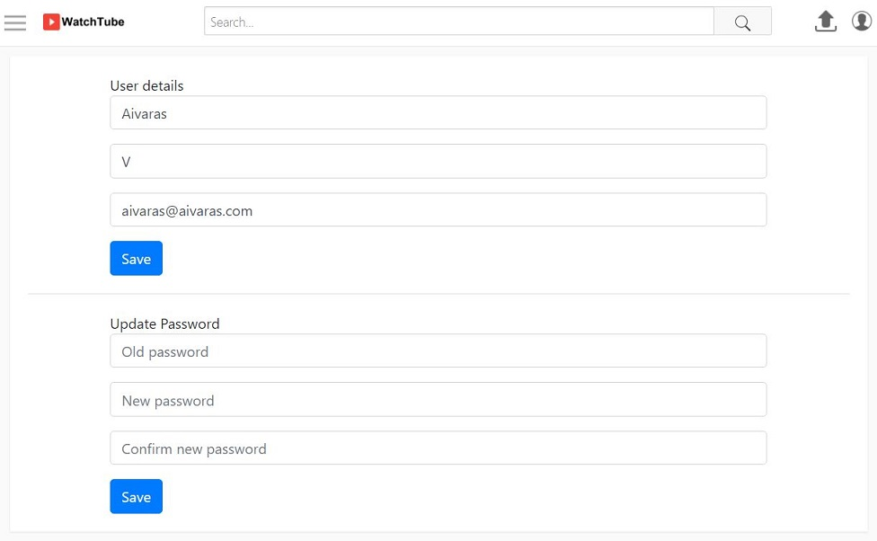

# watchtube
Youtube Clone
Learning object oriented programming PHP + MySQL with some Ajax, JavaScript, jQuerry and CSS.

Index page of Watchtube when not logged in:

Index page of Watchtube when logged in:

Watching video. Users can subscribe to channel, make comments and replies and they can also like/dislike videos and comments:

Users can upload video:

Users can edit theirs video information:

Video search:

User's profile page:

