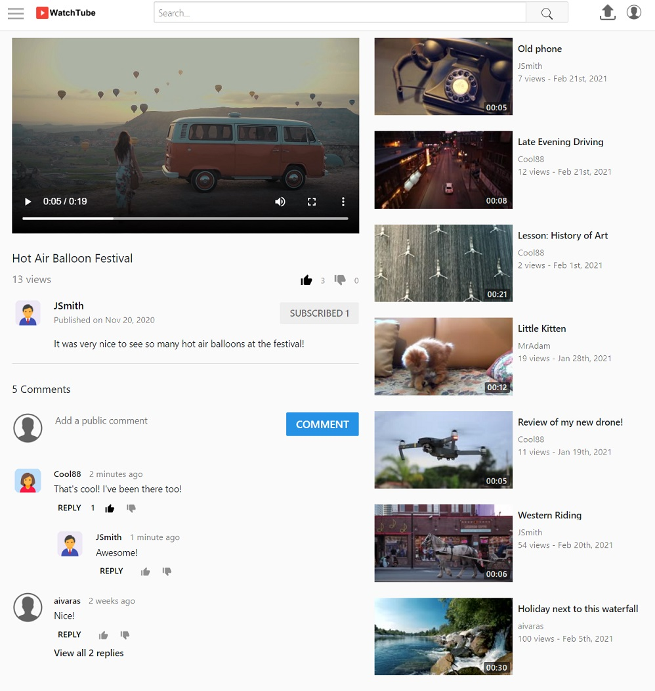

# watchtube
#### Youtube Clone

Created while Learning object oriented programming PHP + MySQL with some Ajax, JavaScript, jQuerry and CSS.

#### Main features:
- Video player
- Video upload
- Video search
- Like/dislike and comment videos
- Subscribe to other channels

Index page of Watchtube when not logged in:

Index page of Watchtube when logged in:

Watching video. Users can subscribe to channel, make comments and replies and they can also like/dislike videos and comments:

Users can upload video:

Users can edit theirs video information:

Video search:

User's profile page:

Based on lessons from [Reece Kenney](https://www.udemy.com/user/reecekenney).

Project uses public domain videos (copyright free).
